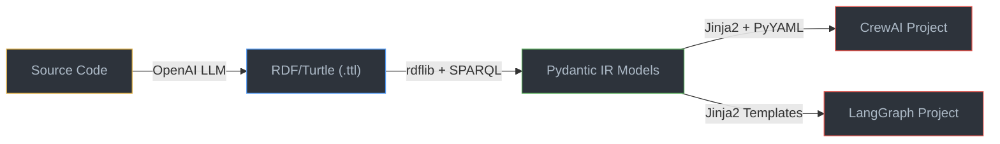

# Agentic AI Framework Generator

[](https://www.python.org/)
[](https://opensource.org/licenses/MIT)
[](https://w3id.org/agentic-ai/onto)
[](#)

A semantic-web-driven code generator that bridges the gap between formal ontology designs and operational multi-agent python applications. By reading RDF/Turtle Knowledge Graphs built with the **Agentic AI Ontology (AgentO)**, this generator parses semantic agentic configurations (agents, tasks, workflows, tools, and prompts) and automatically builds production-ready executable codebases for **CrewAI** and **LangGraph**.

---

## Members (Kelompok 3 - Metode Rekayasa Perangkat Lunak 2026)

| Name | Student ID | GitHub |
|---|---|---|
| Kenji Ratanaputra | 24/534421/PA/22664 | [@Kenzi-GIT](https://github.com/Kenzi-GIT) |
| Ayasha Rahmadinni | 24/545462/PA/23178 | [@ayashar](https://github.com/ayashar) |
| Kevin Antonio Wiyono Lauw | 24/535917/PA/22736 | [@KevinAntonioWiyonoLauw](https://github.com/KevinAntonioWiyonoLauw) |
| Melinda Annastasia Budijono | 24/542840/PA/23052 | [@melinda-ab](https://github.com/melinda-ab) |

---

## Project Overview

**AgentO** is a knowledge-graph-driven code generator that automatically transforms formal ontology definitions into production-ready multi-agent Python applications. It reads **RDF/Turtle Knowledge Graphs** built with the [Agentic AI Ontology (AgentO)](https://w3id.org/agentic-ai/onto) and generates complete, executable codebases for popular agentic AI frameworks.

### What Problem Does It Solve?

Each agentic AI framework (CrewAI, LangGraph, AutoGen, etc.) has its own configuration syntax, project structure, and design patterns. Manually translating a conceptual agent architecture into framework-specific code is **tedious, error-prone, and difficult to keep consistent** across frameworks.

AgentO solves this by providing a **single source of truth** — a Knowledge Graph — from which code for any supported framework can be generated automatically through a deterministic 3-layer pipeline.

### How It Works (Two-Way Engineering)

```
┌─────────────────────────────────────────────────────────────────┐
│                    FORWARD ENGINEERING                          │
│                                                                 │
│  Knowledge Graph (.ttl)                                         │
│        │                                                        │
│        ▼                                                        │
│  Layer 1: SPARQL Extraction (rdflib)                            │
│        │                                                        │
│        ▼                                                        │
│  Layer 2: Pydantic Intermediate Representation (IR)             │
│        │                                                        │
│        ▼                                                        │
│  Layer 3: Code Generation (Jinja2 + PyYAML)                    │
│        │                                                        │
│        ▼                                                        │
│  Executable CrewAI / LangGraph Project                          │
└─────────────────────────────────────────────────────────────────┘

┌─────────────────────────────────────────────────────────────────┐
│                    REVERSE ENGINEERING                          │
│                                                                 │
│  Source Code Directory ──► OpenAI LLM ──► RDF Turtle (.ttl)     │
└─────────────────────────────────────────────────────────────────┘
```

---

## Key Features

| Feature | Description |
|---|---|
| **Ontology-Driven Generation** | Uses the standard [AgentO Ontology](https://w3id.org/agentic-ai/onto) as the formal specification layer |
| **Multi-Framework Output** | Generates complete projects for **CrewAI** (YAML configs + Python) and **LangGraph** (stateful graphs) |
| **3 LangGraph Patterns** | Supports **Linear**, **Tool-Calling**, and **Supervisor** orchestration patterns |
| **CrewAI Best Practices** | Outputs `agents.yaml`, `tasks.yaml`, `crew.py`, `main.py`, `.env.example`, and `inputs.yaml` |
| **Batch & Single Processing** | Process all KGs at once or target a single `.ttl` file |
| **Offline Quality Evaluation** | 3-stage validation pipeline: syntax check → AST-vs-IR comparison → mock runtime execution |
| **Reverse Engineering** | Extract agentic structures from existing codebases into Knowledge Graph instances via LLM |
| **Manifest Generation** | Each output project includes a `manifest.json` with metadata and file listings |

### Dataset Coverage

| Framework | KG Scenarios | Generated Agents | Generated Tasks | Generated Tools |
|---|:---:|:---:|:---:|:---:|
| **CrewAI** | 17 | 52 | 60 | 42 |
| **LangGraph** | 9 | 8 | 17 | 22 |
| **AutoGen** | 6 | — | — | — |
| **Mastra AI** | 35 | — | — | — |
| **Total** | **67** | **60+** | **77+** | **64+** |

---

## System Architecture



**Pipeline per module:**

| Layer | CrewAI | LangGraph |
|---|---|---|
| **Layer 1** — Extraction | `src/crewai/extractor.py` (SPARQL queries) | `src/langgraph/extractor.py` (SPARQL queries) |
| **Layer 2** — IR Models | `src/crewai/models.py` (Pydantic schemas) | `src/langgraph/models.py` (Pydantic schemas) |
| **Layer 3** — Generation | `src/crewai/generator.py` (YAML + Jinja2) | `src/langgraph/generator.py` (Jinja2 templates) |
| **Runner** — CLI | `src/crewai/run.py` | `src/langgraph/run.py` |

---

## Workspace Structure

```
kelompok3-agentic-generator-paper/
│
├── src/                            
│   ├── crewai/                     #   CrewAI code generation module
│   │   ├── extractor.py            
│   │   ├── models.py               
│   │   ├── generator.py            
│   │   ├── run.py                  
│   │   └── templates/              
│   │       ├── crew.py.j2          
│   │       └── main.py.j2          
│   └── langgraph/                  #   LangGraph code generation module
│       ├── extractor.py            
│       ├── models.py               
│       ├── generator.py            
│       └── run.py                  
│
├── scripts/                        
│   ├── evaluate_quality.py         
│   ├── generate_statistics.py      
│   ├── validate_langgraph.py       
│   ├── normalize_kg.py             
│   └── add_kickoff_inputs.py       
│
├── Script/                         
│   ├── run_prompt.py               
│   ├── analysis.prompt.md          
│   └── run_all.sh                  
│
├── generated_kg/                   
│   ├── CrewAI/                     
│   ├── LangGraph/                  
│   ├── AutoGen/                    
│   └── Mastra AI/                  
│
├── output_files/                   
│   ├── crewai/                     
│   └── langgraph/                  
│
├── docs/                           
│   ├── quality_report.md           
│   ├── quality_findings.md         
│   ├── summary_statistics.md       
│   └── validation_results.md       
│
├── paper/                          
│   ├── K-CAP_2025_paper_25.pdf     
│   └── paper-latest.pdf            
│
├── agentO.ttl                      
├── pyproject.toml                  
├── requirements.txt                
├── LICENSE                         
└── README.md                       
```

---

## Tech Stack

| Category | Technology | Purpose |
|---|---|---|
| **Language** | Python 3.10 – 3.13 | Core implementation language |
| **Knowledge Graph** | `rdflib` ≥ 7.0.0 | RDF/Turtle parsing & SPARQL query execution |
| **Data Modeling** | `pydantic` ≥ 2.0.0 | Typed intermediate representation (IR) schemas |
| **Template Engine** | `jinja2` | Code & YAML file generation from templates |
| **YAML Processing** | `pyyaml` | CrewAI configuration file generation |
| **Target Framework** | `crewai` ≥ 0.152.0 | Multi-agent orchestration framework |
| **Target Framework** | `langgraph`, `langchain-core` | Stateful graph-based agent workflows |
| **Target Framework** | `autogen-agentchat` ≥ 0.4.0 | Microsoft AutoGen multi-agent framework |
| **LLM Integration** | `openai` | Reverse engineering (code-to-KG extraction) |
| **Build System** | `hatchling` / `uv` | Modern Python packaging & dependency management |
| **Containerization** | Docker + Docker Compose | Reproducible pipeline execution |

---

## Prerequisites

Before you begin, ensure you have the following installed:

- **Python** `>= 3.10` and `<= 3.13`
  ```bash
  python --version   # should output 3.10.x through 3.13.x
  ```
- **pip** (comes with Python) or **uv** (modern alternative)
- **Git** for cloning the repository
- **Docker & Docker Compose** *(optional — for containerized execution)*
- **OpenAI API Key** *(optional — only needed for reverse engineering)*

---

## Installation Guide

### Step 1 — Clone the Repository

```bash
git clone https://github.com/Software-Engineering-2026-Class/kelompok3-agentic-generator-paper.git
cd kelompok3-agentic-generator-paper
```

### Step 2 — Create a Virtual Environment

**Windows (PowerShell):**
```powershell
python -m venv .venv
.venv\Scripts\activate
```

**macOS / Linux:**
```bash
python3 -m venv .venv
source .venv/bin/activate
```

### Step 3 — Install Dependencies

**Option A — Using pip (standard):**
```bash
pip install -r requirements.txt
```

**Option B — Using uv (recommended, faster):**
```bash
pip install uv
uv sync
```

**Option C — Full install with LangGraph evaluation support:**
```bash
pip install rdflib pandas crewai autogen
pip install langchain-openai langgraph langchain-core pydantic jinja2 pyyaml
```

### Step 4 — Configure Environment Variables *(optional)*

Only required if you plan to use the **reverse engineering** module or run **generated CrewAI/LangGraph projects** that call OpenAI:

```bash
# Create a .env file in the project root
echo "OPENAI_API_KEY=sk-your-key-here" > .env
```

---

## Quick Start with Docker

A complete containerized environment is provided. The whole pipeline (normalize → generate → validate → statistics) is runnable with a single command:

```bash
docker compose up
```

This builds the image on first run and executes the full pipeline. Output appears in `./output_files/`.

### Common Commands

| Command | Purpose |
|---|---|
| `docker compose up` | Run the entire pipeline (normalize → generate → validate → stats) |
| `docker compose run --rm app normalize` | Run only the KG-normalization stage |
| `docker compose run --rm app crewai` | Generate only CrewAI projects |
| `docker compose run --rm app langgraph` | Generate only LangGraph projects |
| `docker compose run --rm app stats` | Generate only framework statistics |
| `docker compose run --rm app bash` | Open an interactive shell inside the image |
| `docker compose --profile pipeline up` | Run each stage as its own container (with `depends_on` ordering) |
| `docker compose --profile llm up` | Also run the optional LLM ontology-population stage (requires `OPENAI_API_KEY`) |
| `docker compose down --rmi local` | Stop and remove containers + the built image |

### Environment Variables

Copy `.env.example` to `.env` and fill in your `OPENAI_API_KEY`. The default pipeline does **not** call the OpenAI API; only the `prompt` service (LLM ontology-population) does. A `.env` is therefore only required if you enable the `llm` profile.

### Pipeline Stages

| Stage | Service (profile `pipeline`) | Container-only (`app`) |
|---|---|---|
| 1. Normalize KGs | `normalize` | `entrypoint.sh normalize` |
| 2. Append kickoff inputs | `kickoff` | `entrypoint.sh kickoff` |
| 3. Generate CrewAI | `generate-crewai` | `entrypoint.sh crewai` |
| 4. Generate LangGraph | `generate-langgraph` | `entrypoint.sh langgraph` |
| 5. Validate | `validate` | `entrypoint.sh validate` |
| 6. Statistics | `stats` | `entrypoint.sh stats` |

The multi-container `pipeline` profile runs each stage in a separate container with `depends_on: condition: service_completed_successfully` ordering, so stages run in sequence and the command exits only when the last one finishes.

---

## Usage Documentation

### 1. Forward Engineering — KG to Code

#### A. Generate All CrewAI Projects (Batch Mode)

Processes all 17 TTL files in `generated_kg/CrewAI/` and outputs complete project directories:

```bash
python -m src.crewai.run
```

**Expected output:**
```
=================================================================
  KG → SPARQL → Pydantic → CrewAI Project Generator
  Pipeline: 3-Layer Conversion (SPARQL / Pydantic / YAML+Jinja2)
=================================================================
  Source : generated_kg/CrewAI
  Output : output_files/crewai
  Files  : 17 knowledge graphs
=================================================================

[Processing] game-builder-crew_instances.ttl
[Processing] gym_planner_instances.ttl
...
=================================================================
  Done. 17/17 projects generated successfully.
=================================================================
```

#### B. Generate a Single CrewAI Project

```bash
python -m src.crewai.run generated_kg/CrewAI/trip_planner_instances.ttl
```

#### C. Generate a LangGraph Project

```bash
python src/langgraph/run.py generated_kg/LangGraph/trip-planner_instances.ttl
```

**Expected output:**
```
Reading KG from generated_kg/LangGraph/trip-planner_instances.ttl...
Detected LangGraph Pattern: tool_calling
- Extracted 1 Agent(s)
- Extracted 4 Tool(s)
- Extracted 4 Node(s)
Generating Python code into output_files/langgraph/trip-planner...
Done!
```

#### D. Generate All LangGraph Projects

**Linux/macOS:**
```bash
for f in generated_kg/LangGraph/*.ttl; do python src/langgraph/run.py "$f"; done
```

**Windows (PowerShell):**
```powershell
Get-ChildItem generated_kg\LangGraph\*.ttl | ForEach-Object {
    python src/langgraph/run.py $_.FullName
}
```

---

### 2. Quality Assurance & Evaluation (Offline)

#### A. Run Comprehensive Quality Evaluation

Executes a 3-stage pipeline — **syntax check** → **AST-vs-IR structural comparison** → **mock runtime execution** — without requiring any API key:

```bash
python scripts/evaluate_quality.py
```

**Expected output:**
```
=======================================================
  Issue #07 - LangGraph Quality Evaluation
  Mode: OFFLINE (no API key required)
=======================================================
  Skenario ditemukan: 9

-------------------------------------------------------
  Evaluasi: trip-planner
-------------------------------------------------------
  [A] Syntax check ... PASS
  [B] Structural check ...
      IR tools (4): ['extract', 'classify', 'list_accommodations', 'list_restaurants']
      AST @tool fns (4): ['extract', 'classify', 'list_accommodations', 'list_restaurants']
      Pattern IR=tool_calling | match=True
  [C] Mock runtime ... PASS
  [Score] 100.0/100

=======================================================
  RINGKASAN AKHIR
=======================================================
  Rata-rata Quality Score: 93.3/100
```

**Generated reports:**
- `docs/quality_report.md` — Per-scenario quality scores and comparison table
- `docs/quality_findings.md` — Root cause analysis (IRI leaks, unnamed tools, pattern misdetection)

#### B. Generate Code Statistics

```bash
python scripts/generate_statistics.py
```

Outputs `docs/summary_statistics.md` with LOC counts, agent/task/tool tallies, and syntax validation results.

#### C. Validate LangGraph Execution (Mock Runtime)

```bash
python scripts/validate_langgraph.py
```

#### D. Normalize Knowledge Graph Files

```bash
python scripts/normalize_kg.py
```

---

### 3. Reverse Engineering — Code to KG

> **Note:** This feature requires an active **OpenAI API key** and internet connectivity.

Extracts the agentic structure of an existing codebase and generates a Turtle instance file:

```bash
# Set your API key
export OPENAI_API_KEY="sk-your-key-here"   # Linux/macOS
# $env:OPENAI_API_KEY="sk-your-key-here"   # Windows PowerShell

# Run extraction on a project folder
cd Script
python run_prompt.py /path/to/agent-project-folder
```

The output `.ttl` file will be written to `agent-o/<folder-name>_instances.ttl`.

---

## Generated Output Structure

### CrewAI Project

Each generated CrewAI project follows the official project structure:

```
output_files/crewai/<scenario>/
├── config/
│   ├── agents.yaml         
│   ├── tasks.yaml          
│   └── inputs.yaml         
├── crew.py                 
├── main.py                 
├── .env.example            
├── pyproject.toml          
└── manifest.json           
```

### LangGraph Project

```
output_files/langgraph/<scenario>/
├── main.py                 
├── requirements.txt        
└── manifest.json           
```

---

## Available Scripts Reference

| Script | Command | Description |
|---|---|---|
| **CrewAI Generator** | `python -m src.crewai.run` | Batch-generate all CrewAI projects |
| **LangGraph Generator** | `python src/langgraph/run.py <file.ttl>` | Generate a LangGraph project |
| **Quality Evaluation** | `python scripts/evaluate_quality.py` | 3-stage offline code quality assessment |
| **Statistics Report** | `python scripts/generate_statistics.py` | Generate LOC/agent/task statistics |
| **LangGraph Validation** | `python scripts/validate_langgraph.py` | Mock runtime execution testing |
| **KG Normalization** | `python scripts/normalize_kg.py` | Clean & standardize TTL files |
| **Add Kickoff Inputs** | `python scripts/add_kickoff_inputs.py` | Inject input bundles into TTL |
| **Reverse Engineering** | `python Script/run_prompt.py <folder>` | LLM-based code-to-KG extraction |

---

## Project Links

| Resource | URL |
|---|---|
| **Repository** | [kelompok3-agentic-generator-paper](https://github.com/Software-Engineering-2026-Class/kelompok3-agentic-generator-paper) |
| **AgentO Ontology** | [https://w3id.org/agentic-ai/onto](https://w3id.org/agentic-ai/onto) |
| **Research Paper** | See `paper/K-CAP_2025_paper_25.pdf` |

---

## License

This project is dual-licensed:

- **Source Code** — [MIT License](LICENSE)
- **AgentO Ontology** — [Creative Commons Attribution 4.0 (CC BY 4.0)](https://creativecommons.org/licenses/by/4.0/)